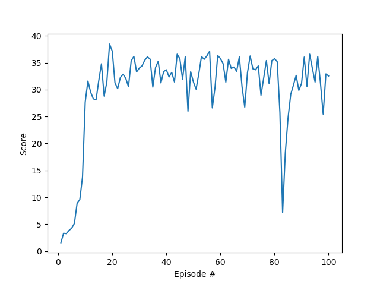

# Project report

## Learning Algorithm

The learning algorithm used in this project is based on the DDPG algorithm. This algorithm uses two agents concurrently, and actor and a critic. Both agents have a local and a target neural network. Both actor and critic have 2 fully connected layers of 64 and 128 units, a batch normalization layer and ReLU activation functions.

Values of other parameters:

- BUFFER_SIZE: int(1e5)
- BATCH_SIZE: 128
- GAMMA: 0.99
- TAU: 1e-3
- LR_ACTOR: 1e-4
- LR_CRITIC: 1e-3
- WEIGHT_DECAY: 0
- NUM_AGENTS: 20

## Plot of Rewards



```
Episode 10	Average Score: 8.13
Episode 20	Average Score: 20.05
Episode 30	Average Score: 24.30
Episode 40	Average Score: 26.72
Episode 50	Average Score: 27.94
Episode 60	Average Score: 28.90
Episode 70	Average Score: 29.49
Episode 80	Average Score: 30.01
Episode 90	Average Score: 29.62
Episode 100	Average Score: 29.92
Solved in 100 episodes, with mean score: 29.92
```

## Trained model

The weights of both the Actor and Critic neural networks can be found inside the folder `checkpoints_solved`

## Ideas for future work

I started with a PPO implementation but didn't manage to solve the environment. Then I realised most students were using the Udacity DDPG implementation and worried: the rest of my time went to find hyperparameters that could solve the problem. So if I have to give an idea for future work it would definitively continue with the PPO implementation. 
